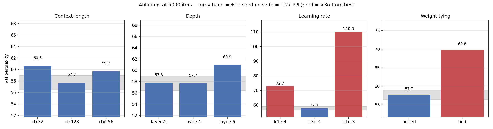
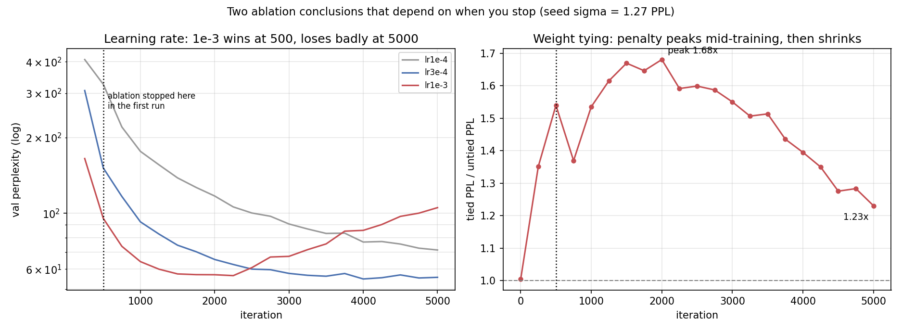

# Mini-GPT — Subword Tokenization, and Which Ablation Results Survive Noise

This project trains the same decoder-only Transformer architecture with a
byte-level BPE vocabulary instead of a character-level one, and runs a full
ablation suite on the result.

📄 **[Technical report (PDF)](report.pdf)** — 4–5 pages: full experimental detail, statistics, and limitations.

Its real contribution is not the model. It is the demonstration that **you
cannot interpret an ablation without first measuring your own noise floor**, and
that doing so overturns two of this project's own apparent findings.

## The intervention

A byte-level BPE tokenizer trained from scratch on the corpus (vocab 2000).
The architecture — every component hand-implemented, no `nn.MultiheadAttention`,
no `transformers`, no pretrained weights — is unchanged from a character-level
baseline; the tokenizer is the only variable.

Trained with HuggingFace `tokenizers` (the BPE *training algorithm* only — no
pretrained weights, no Hub access).

## Confirmed baseline

`d_model=192, n_heads=6, n_layers=4, block_size=128, lr=3e-4, vocab=2000`,
5000 iterations, **2,547,840 parameters**:

| Metric | Value |
|---|---|
| Val loss | 4.0552 |
| **Val perplexity** | **57.70** |
| Training time | 375.8 s (GPU) |

Validation perplexity fell steadily to ~55 by iteration 4000 and then
**flattened while training loss kept dropping** (train 3.31 → 3.14 over the last
1000 iterations, val 54.80 → 55.63). That is the onset of overfitting — the
point at which further training stops buying generalization.

> Subword and character-level perplexity are measured over different units and
> are not on a comparable scale; a raw number here says nothing next to a raw
> number from a differently-tokenized model without a matched control.

## Qualitative behavior

At temperature 1.0, prompt `"ROMEO:"`:

> **JULIET:** Go to: we do.
> **PARIS:** What's he that?
> **Nurse:** 'Tis very near thing to Bolingbroke.
> **Nurse:** Peace, belike! Why, what says the matter, That, have I not so well
> in that word is done? … But, here's Romeo! what's the matter?

The striking property of this output: **every token is a real English word.**
A character-level model sampled under similar conditions typically invents
phonotactically-plausible non-words (`flatterous`, `hourted`) at the same
temperature — spelling errors that a BPE vocabulary makes structurally
unrepresentable, since every token it can produce is drawn from real
subword units. The model has not gotten better at avoiding this error class;
the error class has become impossible to make.

What the fixed vocabulary does not fix: sentence-level coherence. `"'Tis very
near thing to Bolingbroke"` is locally fluent and globally arbitrary. Subword
tokenization removed an entire error class without touching the one that
matters, which is itself the finding — spelling and meaning fail
independently, and fixing one does nothing for the other.

At temperature 1.3 the model degrades into malformed tokens (`accomvour`,
`regable`, `BANurse`) — the BPE vocabulary constrains but does not guarantee
well-formed output once sampling entropy is high enough.

## Results

The ablations were first run at **500 iterations** while the baseline ran at
5000, and this README flagged that mismatch as its main caveat. Re-running the
full suite at 5000 iterations settles it — and reverses two of the original
conclusions.

### The noise floor

Three seeds at baseline: **57.70, 55.45, 55.55 → 56.23 ± 1.27 PPL.** σ = 1.27,
about 2.3% of the mean.

### All axes at 5000 iterations

| axis | config | params | val PPL | vs. best | σ | verdict | time |
|---|---|---|---|---|---|---|---|
| **context** | 32 | 2.55M | 60.61 | +2.91 | 2.3 | marginal | 87 s |
| | **128** | 2.55M | **57.70** | — | — | best | 362 s |
| | 256 | 2.55M | 59.66 | +1.97 | 1.6 | marginal | 871 s |
| **depth** | 2 layers | 1.66M | 57.75 | +0.06 | 0.0 | **noise** | 206 s |
| | **4 layers** | 2.55M | **57.70** | — | — | best | 362 s |
| | 6 layers | 3.44M | 60.91 | +3.21 | 2.5 | marginal | 519 s |
| **learning rate** | 1e-4 | 2.55M | 72.70 | +15.00 | 11.8 | **real** | 362 s |
| | **3e-4** | 2.55M | **57.70** | — | — | best | 362 s |
| | 1e-3 | 2.55M | 110.02 | +52.32 | 41.2 | **real** | 364 s |
| **weight tying** | **untied** | 2.55M | **57.70** | — | — | best | 363 s |
| | tied | 2.16M | 69.82 | +12.12 | 9.6 | **real** | 362 s |



### Finding 1 — the learning-rate conclusion inverts completely

This is the clearest result here: the same comparison, run at two budgets,
gives opposite answers.

| | 500 iters | 5000 iters |
|---|---|---|
| lr 3e-4 | 151.31 | **57.70** |
| lr 1e-3 | **95.39** | 110.02 |
| **winner** | **1e-3**, by 55.9 PPL | **3e-4**, by 52.3 PPL (41σ) |

At 500 iterations this README concluded that *"the baseline learning rate is
mis-tuned"* and that 1e-3 was clearly better. **That conclusion was wrong, and
it was wrong because the ablation stopped before the effect appeared.**

The 1e-3 run reaches 56.50 at iteration 2250 — the best perplexity any run in
this project achieves — and then climbs monotonically to 105.27 by iteration
5000 while its training loss keeps falling (3.00 → 2.29). It is not
under-trained; it has overfit, and the higher learning rate got it there faster.



*Left: the crossing point is at roughly iteration 2500. Any ablation stopped
before it reports the opposite ranking to one stopped after. Right: the tying
penalty over the same run.*

### Finding 2 — depth: noise at 500 iterations, negative at 5000

At 500 iterations, depth was indistinguishable from noise and `layers6` was
nominally best. At 5000, `layers2` and `layers4` are tied to within 0.05 PPL
(0.04σ) and `layers6` is **worse** by 3.21 PPL.

`layers6` bottoms out at 54.38 (iteration 4000) — better than the baseline ever
reaches — then rises to 60.14. More depth means faster fitting and earlier
overfitting, not better final performance at this corpus size and this
tokenization: BPE compresses ~1.1M characters into ~390k tokens, so the
effective dataset seen per iteration is a fraction of what a
finer-grained tokenization would provide, and the larger model reaches the
overfitting regime correspondingly sooner.

### Finding 3 — weight tying's penalty rises before it falls

Tying costs 12.12 PPL (9.6σ) at 5000 iterations, down sharply from 81.7 PPL
(19.6σ) at 500 — confirming the general prediction that **the penalty shrinks
as training budget grows.** The full per-iteration curve, computed directly
from this project's own training logs, shows the shrinkage is not
monotonic:

| iter | 250 | 500 | 1000 | 2000 (peak) | 3000 | 5000 |
|---|---|---|---|---|---|---|
| tied/untied ratio | 1.35× | 1.54× | 1.54× | **1.68×** | 1.55× | **1.23×** |

The ratio *rises* for the first 2000 iterations, peaks at 1.68×, and only
then declines — still falling when the run ends at 5000, so it would likely
continue shrinking with more training. A single before/after comparison
(500 vs.\ 5000) would have missed this non-monotonic shape entirely and
reported only "the penalty shrinks," which is true but incomplete: it
shrinks after first getting worse.

### Finding 4 — almost everything here is overfitting

Where each configuration reached its minimum, and how far it drifted after:

| config | min PPL | at iter | final | drift |
|---|---|---|---|---|
| ctx128 (baseline) | 54.80 | 4000 | 55.63 | +0.8 (0.7σ) |
| ctx256 | 55.05 | 3750 | 58.85 | +3.8 (3.0σ) |
| layers6 | 54.38 | 4000 | 60.14 | +5.8 (4.5σ) |
| **lr1e-3** | **56.50** | **2250** | **105.27** | **+48.8 (38σ)** |
| tied | 68.45 | 5000 | 68.45 | still improving |

Only the tied model is still improving at iteration 5000 — consistent with
Finding 3, since tying slows training rather than capping it.

**5000 iterations is past the optimum for this model and corpus.** Every number
in the table above is therefore a measurement of "perplexity after overfitting
for a while," not of best achievable perplexity — which is itself the reason
the rankings differ from the 500-iteration run.

## Reproducing

```bash
pip install -r requirements.txt
python train.py --tag baseline                 # the 5000-iteration baseline
python sweep.py --axis all --max_iters 500     # the full table above
python evaluate.py --summary checkpoints/summary_baseline.json
python generate.py --ckpt checkpoints/model_baseline.pt --prompt "ROMEO:" \
    --temperature 0.7 1.0 1.3 --seed 42
```

`sweep.py` calls `train.run_training()` directly rather than reimplementing the
loop, so every ablation run is byte-for-byte the same code path as the baseline.

## Files

```
tokenizer.py   # trains/loads the byte-level BPE tokenizer
data.py        # BPE-tokenized batching
model.py       # decoder-only Transformer, implemented from primitives
train.py       # run_training() factored out of main()
sweep.py       # --axis context|depth|lr|tie|seeds|all
evaluate.py    # metrics block from checkpoint or summary.json
plot_results.py
generate.py    # multi-temperature, seed-matched sampling
make_figures.py # regenerates the two figures above from checkpoints/
```

## Two real bugs, and how they were caught

### The project was not runnable from a fresh clone

During development the corpus file happened to already be present on disk from
earlier manual testing, so the missing downloader was invisible; on a clean
clone (where downloaded data is correctly gitignored) the failure surfaced as
a bare `Exception: No such file or directory (os error 2)` thrown from inside
the Rust `tokenizers` library, several frames below any code in this repo and
with no mention of the missing corpus.

`data.py` now fetches the corpus on demand, and `prepare_dataset()` and
`get_tokenizer()` both call it, so every entry point is covered. Verified by
deleting `input.txt`, `tokenizer_files/` and `__pycache__/` and running
`train.py` and `sweep.py` from scratch.

The general shape of this one is worth noting: the code was correct on the
machine it was written on and broken everywhere else, and the error message
pointed at a dependency rather than at the cause.

### The tokenizer cache ignored vocab_size

`get_tokenizer()` returned any cached tokenizer on disk **without checking its
vocabulary size against the requested one.** Training once at `--vocab_size 500`
and later at `2000` without clearing `tokenizer_files/` would silently reuse the
500-token tokenizer — no error, just a quietly wrong experiment.

It surfaced during the weight-tying sweep, where the reported parameter counts
did not match `vocab_size × d_model`. `generate.py` had the identical latent
bug: it loaded whatever tokenizer was cached rather than the one its checkpoint
was trained with, which produced a shape-mismatch crash on a checkpoint from a
different vocab size. Both now verify the cached tokenizer against the
requested/recorded size and retrain on mismatch.

The general lesson is the one this whole project is about: the failure mode that
matters is not the crash, it is the silent one.

## Scope and honesty

- BPE is trained on this exact small corpus, so the vocabulary is tuned to Tiny
  Shakespeare specifically and would not transfer.
- Ablations are now run at 5000, matching the baseline. The 500-iteration
  numbers are retained in Findings 1 and 3 as the *comparison point*, not as
  the headline.
- Three seeds bounds the noise; it does not establish effects. The σ = 1.27 used
  throughout is itself estimated from only three samples.
- One axis at a time from one baseline point: interaction effects (does optimal
  LR shift with depth?) are untested.

## Path to a publishable result

An earlier version of this section proposed the paper as a hypothesis: *"run the
ablation grid at several budgets and report how many conclusions flip."*

**The flip has now been observed twice, with the mechanism visible.** The
learning-rate ranking inverts at roughly iteration 2500 (Finding 1), and the
weight-tying penalty rises for 2000 iterations before it starts to fall
(Finding 3) — both cases where a correctly-run, correctly-analysed ablation
gives a materially different answer depending on when it is read.

The paper: **"Ablation conclusions are a function of the training budget you
stopped at, and that budget is rarely reported alongside the conclusion."**

The evidence already in hand:

| observation | source |
|---|---|
| LR ranking inverts at ~2500 iters (41σ at 5000) | this project, single run |
| Tying penalty rises to a peak at iteration 2000, then falls (1.35× → 1.68× → 1.23×) | this project, single run |
| Depth is noise at 500 iters, negative at 5000 | this project, single run |

What is missing to make it a paper:

1. **The budget sweep run as a designed experiment**, not read off single runs'
   evaluation curves — 250 / 500 / 1k / 2.5k / 5k / 10k, each with independent
   runs and its own seed study. Seed variance almost certainly grows as budget
   shrinks, and quantifying that is half the point.
2. **A second corpus**, so the result is not about Shakespeare.
3. **A second tokenization at the same scale**, to test whether the specific
   crossover points (iteration ~2500 for the LR reversal, ~2000 for the tying
   peak) are properties of this corpus and architecture or artifacts of this
   particular vocabulary.
4. **Early stopping as a control arm.** Every reversal here involves at least
   one configuration that is past its minimum. Would the conclusions be stable
   if every run were evaluated at *its own* best checkpoint rather than at a
   fixed iteration count? If so, the finding sharpens: it is not budget per se
   but the *interaction between budget and early stopping* that breaks
   ablations — and that is a directly actionable recommendation.

Item 4 is the one that would make it useful rather than merely cautionary, and
it is cheap: the loss logs to answer it already exist in `checkpoints/`.

This is a workshop paper on empirical methodology. It is not an architecture
contribution and does not pretend to be.
